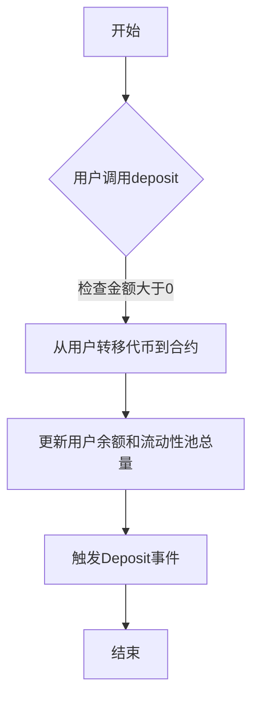
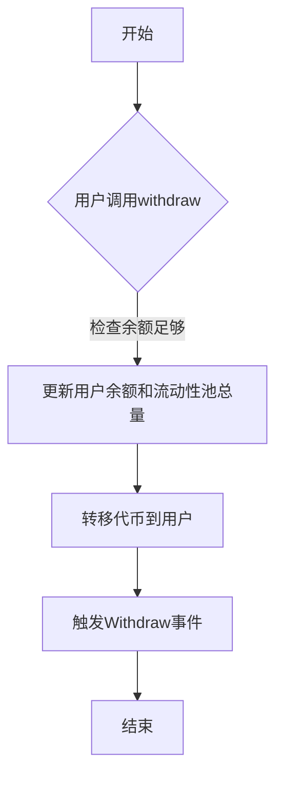
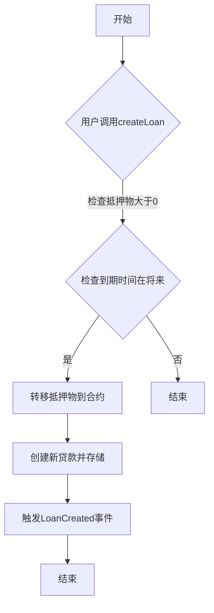
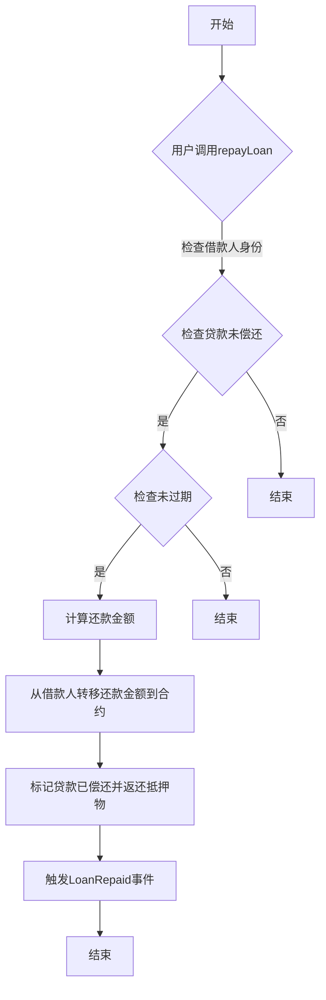
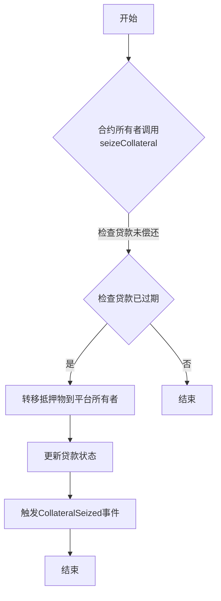

### 代码功能解释

这段Solidity代码实现了一个名为`PledgePool`的智能合约，主要功能包括：

1. **存款与提款**：用户可以将ERC20代币存入流动性池或从中提取。
2. **创建贷款**：用户可以使用ERC20代币作为抵押物来创建贷款。
3. **偿还贷款**：借款人可以在贷款到期前偿还贷款，包括本金和利息。
4. **清算过期贷款**：合约所有者可以清算未偿还的过期贷款，获取抵押物。
5. **管理功能**：合约所有者可以设置平台费用率。

### 控制流图（CFG）

#### 存款功能

#### 提款功能

#### 创建贷款功能

#### 偿还贷款功能

#### 清算过期贷款功能

这些流程图展示了各个功能的基本控制流，帮助理解每个功能的执行步骤。